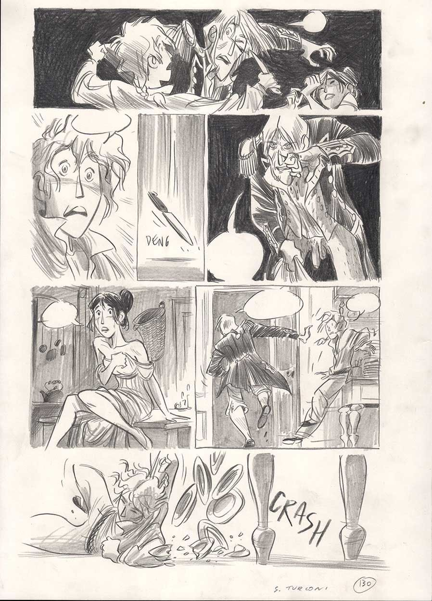
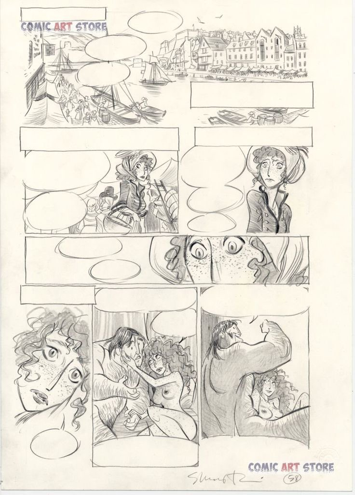
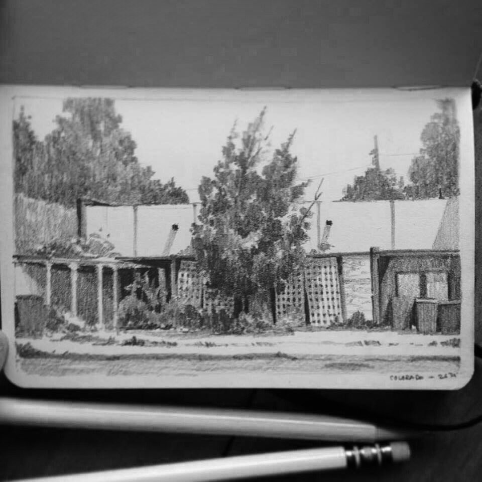
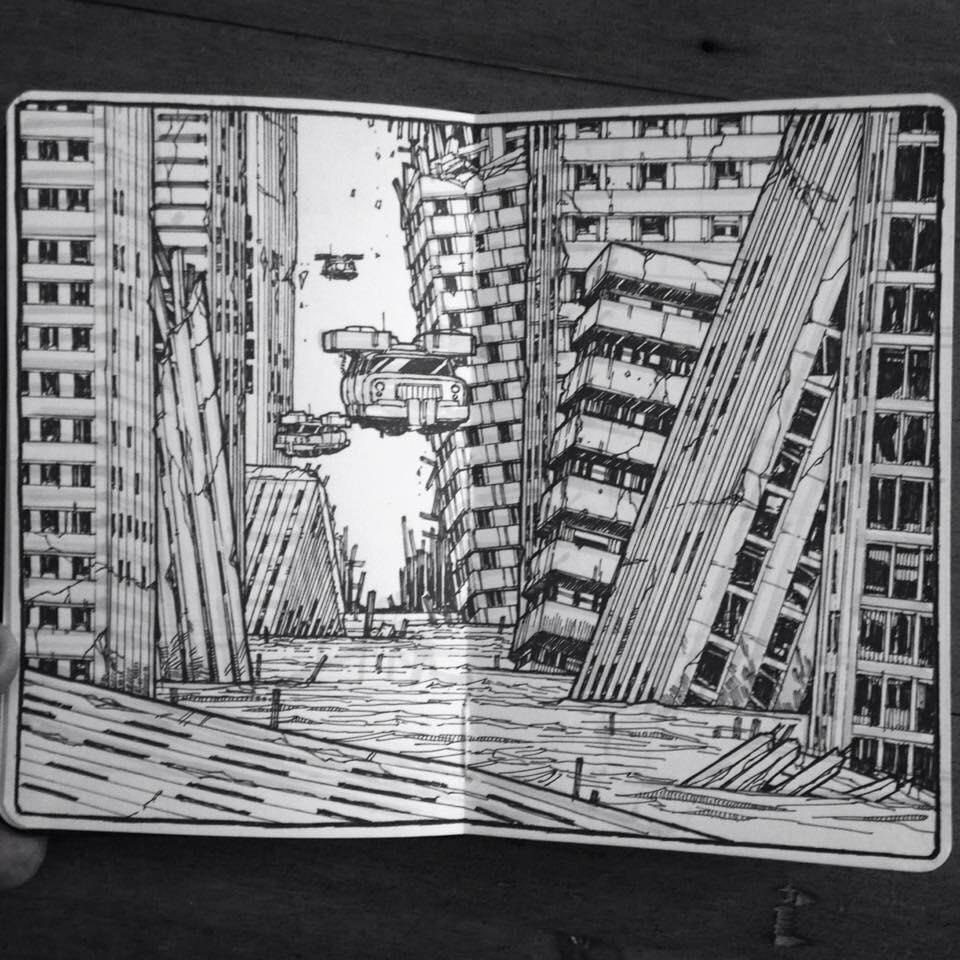

# 29/03/2020

**Table of contents**

*Tech*

- Ghidra and Gameboy Roms
- Flutter vs HTML/JavaScript/CSS
- Semantic HTML Cheatsheet

*Art*

- How to mix different colors in watercolor
- Life Drawing Class live from the Royal Academy of Art with Sarah Simblet
- Sketching ideas: Yoga poses and my Apple //c
- Art of the day: pencil drawings by Stefano Turconi

## Ghidra and Gameboy Roms

This weekend I needed to reverse engineer an old FoxPro program and played a little with [Ghidra](https://ghidra-sre.org/) to start getting acquainted with it. It's a bit tricky to get the hang of it but I want to use it to debug GB and C64 Roms as well. For this I need to understand how to extend Ghidra. Found this article [Ghidra Loader for Super Mario Bros. 3 NES ROM](https://smb3.bf0.org/ghidra-loader/ghidra-plugin/2019-08-20-ghidra-loader/) which talks about **Ghidra loaders** whish is, aparently, what I need to create. There are a couple of Ghidra loaders for GB/GBA cartridges already. See links below.

### Links 🔗

- [Software Reverse Engineering (SRE) Framework: Journey from Classified NSA Tool to Open Source - 2019 Blackhat presentation](files/2020-03-29/blackhat2019.pdf)
- [Ghidra Loader for Super Mario Bros. 3 NES ROM](https://smb3.bf0.org/ghidra-loader/ghidra-plugin/2019-08-20-ghidra-loader/) This is interesting because it discusses how to handle ROM which map different banks of the cartridge to the same physical address which is something we'll need for our GB loader. It also discusses how to create a symbol table with specific addresses like IO mapped locations, etc.
- [Some code on Github from this article](https://github.com/fortenbt/Ghidra-SMB3INES-Loader)
- [A Ghidra Loader plugin for the Nintendo Switch](https://github.com/Adubbz/Ghidra-Switch-Loader)
- [[WIP] A simple Ghidra loader for GameBoy ROMs]([https://github.com/ImNotAVirus/ghidra-gb](https://github.com/ImNotAVirus/ghidra-gb)
- [GhidraGBA: GBA ROM loader for ghidra]([https://github.com/SiD3W4y/GhidraGBA](https://github.com/SiD3W4y/GhidraGBA)
- [Ghidra Decompiler & Disassembler - Awesome List]([https://www.retroreversing.com/ghidra](https://www.retroreversing.com/ghidra)
- [Nintendo 64 decompiling with Ghidra]([https://www.retroreversing.com/n64-decompiling](https://www.retroreversing.com/n64-decompiling)
- [N64 ROM Loader for Ghidra by Warranty Voider]([https://github.com/zeroKilo/N64LoaderWV](https://github.com/zeroKilo/N64LoaderWV))

### Ideas💡

- Create a Ghidra loader for GB Roms, C64 programs and/or [C64 Vice Snapshots]([https://vice-emu.sourceforge.io/vice_9.html](https://vice-emu.sourceforge.io/vice_9.html))
- Add to Ghidra all the known Symbols (addresses) and its documentation for C64, GB and Apple II

## Flutter vs HTML/JavaScript/CSS

I read an article I related a lot with about the current crazy state of JavaScript development. The article touted the use of [Flutter](https://flutter.dev/) as Google's killer to the JS/HTML/CSS madness. I want to read more. If I find the article I'll link it here.

### Links 🔗

- [Flutter for React Native developers](https://flutter.dev/docs/get-started/flutter-for/react-native-devs)
- [Desktop support for Flutter](https://flutter.dev/desktop)
- [Flutter sample apps](https://github.com/flutter/samples/tree/master/gallery)

### Ideas💡

- Create a Flutter app to browse my collection of Tumblr and Instagram reference photos.
- Create a Flutter app with basic image processing: crop, resize, B&N, etc. Things that I need to do quickly and don't want to open Photoshop or Gimp.
- Create an app to create 3D modles quickly which has a UI very similar to SketchApp but Open Source. The design will be focused on creating furniture with wood so the modeling might be based on operations that are equivalent of what you would do in the shop: crosscuts, holes, etc.

## Semantic HTML Cheatsheet

This is a helpful cheatsheet for writting semantic HTML I found in [this tweet]([https://twitter.com/housecor/status/1243625787426844672](https://twitter.com/housecor/status/1243625787426844672)

## How to mix different colors in watercolor

One of my favorite parts of the book **"The Big Book of Watercolor"** from *José M. Parramón* is the chapter **Color MIxing in Watercolor** which has several illustration on page 121-126 with four color swatches and how to mix those colors. They are divided in warm, cold and broken colors. Here are the illustrations

## Life Drawing Class live from the Royal Academy of Art with Sarah Simblet

I love Sarah Simblet's drawings and enjoyed watching this TV program where she hosts a live drawing class on YouTube from [The Royal Academy](https://www.royalacademy.org.uk/). You can watch the [YouTube video here](https://www.youtube.com/watch?v=O4nWj_87Njs).

Here are some high resolution scans of two of Sarahs drawings I found [here](https://www.royalacademy.org.uk/art-artists/name/sarah-simblet).

## Sketching ideas: Yoga poses and my Apple //c

A couple of ideas for sketching:

- I want to create a series of quick sketches  of Yoga poses by taking screenshots of the exercises in the app **Down Dog**.

- Do some sketches of my Apple //c with pencil and watercolor

## Art of the day: pencil drawings by Stefano Turconi and John Sweeney

I found some beatiful pencil comic book drawings by **Stefano Turconi** in a series of tweets from the account of [Horacio Altuna](https://twitter.com/HoracioAltuna/status/1243670603065851905/photo/1)

Some sketchbook illustrations from [John Sweeney](https://twitter.com/johnsweeney2147)

