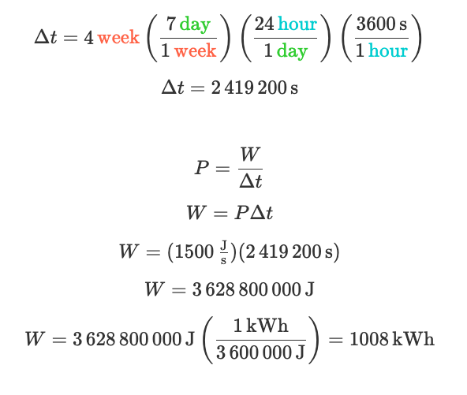

# 01/04/2020

**Contents**

*Tech*

- **file2img** a small utility that can interpret any binary file as image data

*Science*

- Lecture slides from Deep Natural Language Processing Oxford University course

- Trax: state of the art deep learning library

- How to calculate cost of a particular device based on wattage

- Feynman's PhD Thesis

## 

## file2img: small utility that can interpret any binary file as image data

**file2img** is a small utility that can interpret any binary file as image data, in a variety of pixel formats. It's useful for looking at file contents in a visual manner, and for extracting usable images from arcane formats.

See repo [here]([https://github.com/lunasorcery/file2img](https://github.com/lunasorcery/file2img).

## Lecture slides from Deep Natural Language Processing Oxford University course

There is a Github repo with all the slides from this Machine Learning course: [Deep Natural Language Processing]([https://github.com/oxford-cs-deepnlp-2017/lectures](https://github.com/oxford-cs-deepnlp-2017/lectures)

The descripcion of the course is the following (from the Github repo)

"This is an advanced course on natural language processing. Automatically processing natural language inputs and producing language outputs is a key component of Artificial General Intelligence. The ambiguities and noise inherent in human communication render traditional symbolic AI techniques ineffective for representing and analysing language data. Recently statistical techniques based on neural networks have achieved a number of remarkable successes in natural language processing leading to a great deal of commercial and academic interest in the field

This is an applied course focussing on recent advances in analysing and generating speech and text using recurrent neural networks. We introduce the mathematical definitions of the relevant machine learning models and derive their associated optimisation algorithms. The course covers a range of applications of neural networks in NLP including analysing latent dimensions in text, transcribing speech to text, translating between languages, and answering questions. These topics are organised into three high level themes forming a progression from understanding the use of neural networks for sequential language modelling, to understanding their use as conditional language models for transduction tasks, and finally to approaches employing these techniques in combination with other mechanisms for advanced applications. Throughout the course the practical implementation of such models on CPU and GPU hardware is also discussed."

The course is very complete and is divided into 5 repos: one for the lecture notes / slides, three practical repos that have very well guided assignments with IPython notebooks to get you started on the work. And a finaly repo which is has a couple of alternatives which students cam choose from to continue work.

### Links 🔗

We usually add a list of links at the end with links related to this

- [Oxford Deep NLP 2017 course]([https://github.com/oxford-cs-deepnlp-2017/lectures](https://github.com/oxford-cs-deepnlp-2017/lectures) This repository contains the lecture slides and course description for the [Deep Natural Language Processing](http://www.cs.ox.ac.uk/teaching/courses/2016-2017/dl/) course offered in Hilary Term 2017 at the University of Oxford.
- [Practical 1: word2vec]([https://github.com/oxford-cs-deepnlp-2017/practical-1](https://github.com/oxford-cs-deepnlp-2017/practical-1) We will be training word2vec models on TED Talk and Wikipedia data, using the word2vec implementation included in the Python package `gensim`. After training the models, we will analyze and visualize the learned embeddings.
- [Practical 2: Text Classification](https://github.com/oxford-cs-deepnlp-2017/practical-2) TED stands for “Technology, Entertainment, and Design”. Each talk in the corpus is labeled with a series of open labels by annotators, including the labels “technology”, “entertainment”, and “design”. Although some talks are about more than one of these, and about half aren’t labeled as being about any of them! In this assignment, you will build a text classification model that predicts whether a talk is about technology, entertainment, or design--or none of these.
- [Practical 3: Text Classification with RNNs]([https://github.com/oxford-cs-deepnlp-2017/practical-3](https://github.com/oxford-cs-deepnlp-2017/practical-3) In this practical, you can explore one of two applications of RNNs: text classification or language modelling (you are welcome to try both, too). We will be using the training/dev/test splits that we created in Practical 2.
- [Natural Language Processing [NLP] topic in Github]([https://github.com/topics/natural-language-processing](https://github.com/topics/natural-language-processing) A list of repositories hosted on Github abut NLP
- [The Annotated Transformer]([http://nlp.seas.harvard.edu/2018/04/03/attention.html](http://nlp.seas.harvard.edu/2018/04/03/attention.html) Presents an annotated version of a [paper]([https://arxiv.org/abs/1706.03762](https://arxiv.org/abs/1706.03762) which introduces a new simple network architecture, the Transformer, based solely on attention mechanisms, dispensing with recurrence and convolutions entirely which was a novel alternative technique (in 2017) to tackle NLP tasks such as translating text. The annotated version is basically a IPython version of the paper.

## Trax: state of the art deep learning library

[Trax](https://github.com/google/trax) helps you understand and explore advanced deep learning. We [focus](https://github.com/google/trax#structure) on making Trax code clear while pushing advanced models like [Reformer](https://github.com/google/trax/tree/master/trax/models/reformer) to their limits. Trax is actively used and maintained in the [Google Brain team](https://research.google.com/teams/brain/). Give it a try, [talk to us](https://gitter.im/trax-ml/community) or [open an issue](https://github.com/google/trax/issues) if needed.

The page also recommends [Gin-config](https://github.com/google/gin-config) which is basically a way to create and populate objects via object injection. Sounds interesting.

## How to calculate cost of a particular device based on wattage

Most electronic devices come with a specification indicating what is its wattage (how many Watts it consumes). It is useful to understand how this translate to cost in your electric bill. There is a site called  [Explorable Physics]([https://landgreen.github.io/physics/](https://landgreen.github.io/physics/) which has course notes for algebra based physics course. []The section Power]([https://landgreen.github.io/physics/notes/circuits/power/](https://landgreen.github.io/physics/notes/circuits/power/) has a very clean explenation on how to calculate the cost if you know the price of electricity in killowatt hour. Here I copy the information on how to calculate this. 

**Definition**

Power is defined as work done over time. Power measures the rate that voltage sources, like batteries, convert energy into electrical energy. Power could also measure the rate that electrical components convert electrical energy in other forms.

![P = power [W, J/s, watt] / W = work, change in energy [J, joules] / Δt = time period [s, second]](imgs/2020-04-01/power-definition.png)

**Problem**

The label on my electric space heater says 1500 watts. This means it can convert 1500 joules of electrical energy into thermal energy every second. How many joules of energy can it add to a room in an hour?

**Solution**

W = P x Δt = (1500 W) (3600 s) = (1500 J/s) (3600s) = 5400000 J

Power bills in America use a unit called kilowatt hour. This is actually a unit of energy, not power.

(kilo) (watt) (hour) = (1000) (J/s) (3600 s) = 3,600,000 J => **1kWh = 3,600,000 J**

**Example:** How many kilowatt hours of energy would I consume if I ran my 1500 W electric heater at full power for 4 weeks?

**Example:** The average price in the United States for 1 kilowatt hour is $0.12. How much would the kilowatt hours from the previous problem cost in dollars?

W = 1008 kWh , Cost = W x (\$0.12 / 1 kWh)  = \$120.96

## Feynman's PhD thesis

I found a [great video](https://www.youtube.com/watch) which summerizes his PhD thesis. You can also download the [PDF of his thesis](https://cds.cern.ch/record/101498/files/Thesis-1942-Feynman.pdf) and read it. The author of the video also recommended these [notes on Classical Mechanics, Lagrangian and Principle of Least Action](files/2020-04-01/classical-dynamics-david-tong-cambridge.pdf) and [Feynman's Nobel address](https://www.nobelprize.org/prizes/physics/1965/feynman/lecture/)
