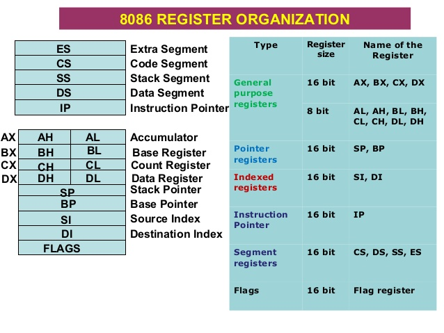

# 12/04/2020

**Contents**

*Tech*

- Revision2020 Notes

## Revision2020 Notes

It's that time of the year again: Revision 2020 party. This weekend (Easter weekend) the Coronavirus has forced the demo party to be remote which means we get to experience it. In here I'll drop my notes and links to stuff I find interesting.

### 256b Dosbox demo

The first demo that caught my eyes is [this one](https://www.youtube.com/watch?v=Imquk_3oFf4). Its a 256 **byte** demo. I always find it amazing this can be done so I want to try to understand some of the trick used here. Fortunately this time the entry ([you can downoad it here](https://www.pouet.net/prod.php?which=85227)) comes with the source code! To run it (in Linux, of course) all you need is to install `dosbox` with `$ sudo apt-get install dosbox`, unzip it in a directory and run it with: `dosbox -conf dosbox-0.74-3.conf memories.com`. This will work fine without Audio (at least in my case there is no audio. I'll see how to set it up a bit later)

In the meantime I'll write more notes here as I dive into the code. First some reminder of the registers in the 8086/80256:

The first thing you find in the code is that it calls the infamous `int 10h` with `al` register set to `0x13`.

### Links 🔗

- [Memories 256b demo](https://www.pouet.net/prod.php?which=85227) - Entry in Pouet.
- [YouTube Video of demo running](https://www.youtube.com/watch?v=Imquk_3oFf4) - Video where can see the demo running
- [The list of all interrupts that are currently supported by the 8086 assembler emulator](http://www.ablmcc.edu.hk/~scy/CIT/8086_bios_and_dos_interrupts.htm)

### Ideas💡

These are some ideas that I have related to this topic

- Idea number 1
