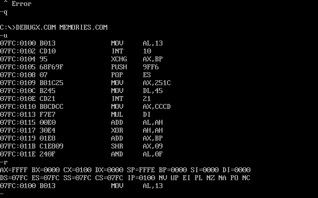

# 12/04/2020

**Contents**

*Tech*

- Revision2020 Notes
- Revision2020 Seminar: Implementing a Physically Based Shading without locking yourself in
- Revision2020 Seminar: Modern 64k intro compression (Ferris) - Revision Online 2020 #Demoscene #Revision

## Revision2020 Notes

It's that time of the year again: **Revision 2020 party**. This weekend (Easter weekend) the Coronavirus has forced the demo party to be remote which means we get to experience it. In here I'll drop my notes and links to stuff I find interesting.

### 256b Dosbox demo

The first demo that caught my eyes is [this one](https://www.youtube.com/watch?v=Imquk_3oFf4). Its a 256 **byte** demo. I always find it amazing this can be done so I want to try to understand some of the trick used here. Fortunately this time the entry ([you can downoad it here](https://www.pouet.net/prod.php?which=85227)) comes with the source code! To run it (in Linux, of course) all you need is to install `dosbox` (and `nasm` if you want to compile the code) with:


 `$ sudo apt-get install dosbox nasm`

 unzip it in a directory and run it with:

 `dosbox -conf dosbox-0.74-3.conf memories.com`

to compile do:

  `nasm memories-dosbox.asm -fbin -o test.com`

This will work fine without audio (at least in my case there is no audio. I'll see how to set it up a bit later)

I'll write more notes here as I dive into the code. First some reminder of the registers in the 8086/80256 to understand a bit the listing:


**Notes**

- To look at the status of registers and debug the app you can run DEBUGX with Dosbox with:

  ```
  $ dosbox -conf dosbox-0.74-3.conf DEBUGX.COM
  ```



### Links 🔗

- [Memories 256b demo](https://www.pouet.net/prod.php?which=85227) - Entry in Pouet.
- [YouTube Video of demo running](https://www.youtube.com/watch?v=Imquk_3oFf4) - Video where can see the demo running
- [The list of all interrupts that are currently supported by the 8086 assembler emulator](http://www.ablmcc.edu.hk/~scy/CIT/8086_bios_and_dos_interrupts.htm)
- [Intro and resources to 8086 assembly]([Introduction to x86 Assembly Language](http://www.c-jump.com/CIS77/ASM/Assembly/lecture.html)) - lecture notes from course [CIS-77 Introduction to Computer Systems](http://www.c-jump.com/CIS77/CIS77syllabus.htm)
- [Modes of Memory Addressing on x86](http://www.c-jump.com/CIS77/ASM/Memory/lecture.html) - lecture notes from same course as above
- [MS-DOS DEBUG Program](https://thestarman.pcministry.com/asm/debug/debug.htm)
- [MS-DOS Github repo with source code](https://github.com/microsoft/MS-DOS)
- [Graphics Programming Black Book by Michael Abrash](https://www.drdobbs.com/parallel/graphics-programming-black-book/184404919)

### enigma 256b

- [256b - Enigma by Marquee Design](https://www.pouet.net/prod.php?which=85232)


## Revision2020 Seminar: Implementing a Physically Based Shading without locking yourself in

This was an awesome presentation on the basic laws of physics involved in the propagation of light in different materials. The author (Zavie / Ctrl-Alt-Test) walks us through the different physical laws that related to how light bounces and travels through mediums. He also shows a Shadertoy demo which show how light interacts in a boundry between to mediums. The shader allows you to tweak a lot of parameters and you can see how interference between the sources at the interface give rise to the reflected and refracted wavefronts. Really neat!

### Links 🔗

- [Presentation](https://docs.google.com/presentation/d/1HAurGBpZ7OQPFc5IydRVUx3ZKfO8h7EIQp3At2vxM6Y/edit#slide=id.p)
- [Shadertoy with simulation of light hitting a boudry](thttps://www.shadertoy.com/view/tsfyRB)
- [Filament is a real-time physically-based renderer written in C++. It is mobile-first, but also multi-platform.](https://google.github.io/filament/)
- [Filament Github repo](https://github.com/google/filament)

## Revision2020 Seminar: Modern 64k intro compression (Ferris) - Revision Online 2020 #Demoscene #Revision

This is a seminar that talks about squishy which is an `.exe` -> `.exe` encoder. What this is is a program which takes as input an Windows executable and produces an *new* executable but with a much smaller size. The compressor is optimized for 64K demos. The talk is very good. Some takeaways and things he talks about:

- models for compressing strings of bits
- probabilities of `1` or `0` might depend on what happened in previously so probabilities are *not* independent on the order. This is

### Ideas💡

- Investigate if ML techniques can be used to try to predict what bits are next

### Links 🔗

- [Slides](https://docs.google.com/presentation/d/1R5rUtGlJdMhkZoLYLzVKF4iV__APYYpxRoowaX8_anQ/edit#slide=id.p)

## Random notes

### Links 🔗

- [Teach Yourself Demoscene in 14 Days](https://github.com/psenough/teach_yourself_demoscene_in_14_days)
- [The book of shaders](https://thebookofshaders.com/)
- [tooll.io - CREATE BEAUTIFUL INTERACTIVE REALTIME CONTENT](http://www.tooll.io/)
- [Tooll.io Github repo](https://github.com/framefield/tooll)


Demos I liked:

**4K Intro**

- [4k Intro - stuck by jetlag](https://www.pouet.net/prod.php?which=85243) - [YouTube](https://www.youtube.com/watch?v=5k0OiT8X3z0)

**Amiga**

- Amiga demo - Netflex und Chill

**PC Demo**

- [Playlist in YouTube with all PC Demo entries](https://www.youtube.com/watch?v=TTurqolLDRM&list=PLr8dKmx4nsukXKnwwyunf8TES7bz-hej-&index=3&t=0s)
- Erpholia
- Parallel Multiverse Oldskool Java Demo [Source code]](https://github.com/Moon70/ParallelMultiverse)
- Second One - WebGL
- Eternal Forress
- Transmissitting Beyond
- Isolated, In Sunlight
- Dopaminecraft - Made with Notch
- Twisted
- VX2
- Cathodoluminescence
- Home - Tooll3
