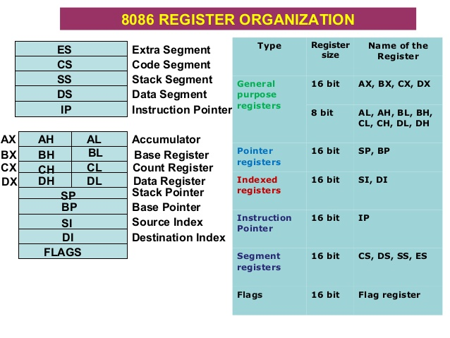
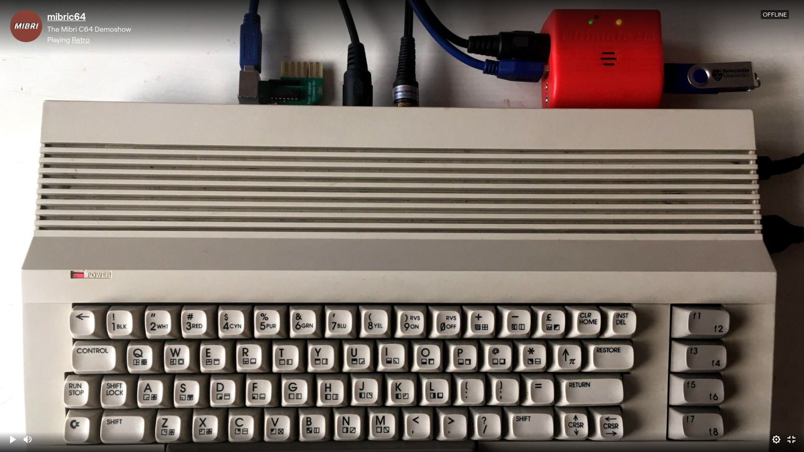
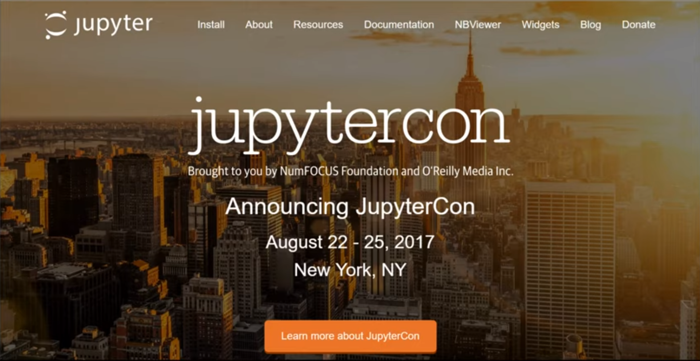
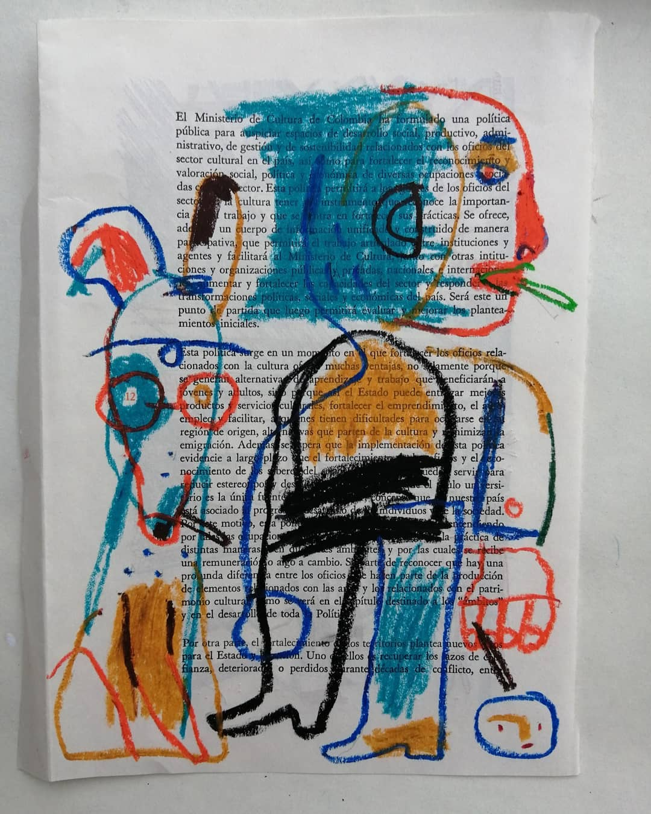
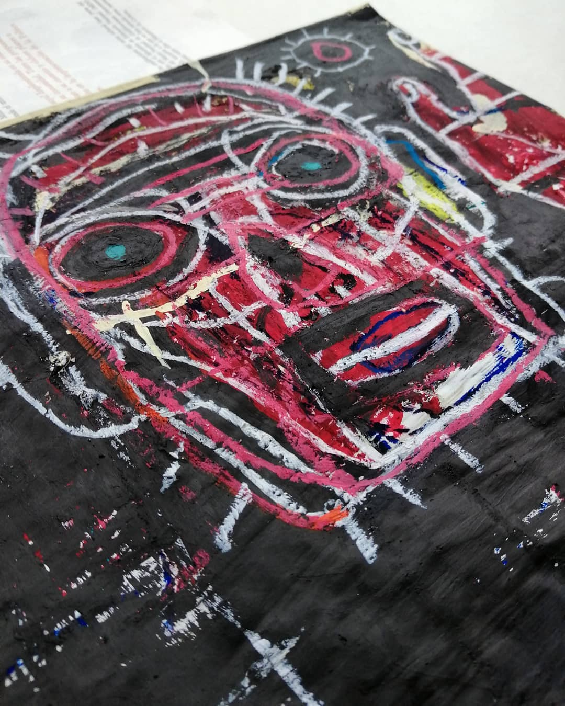
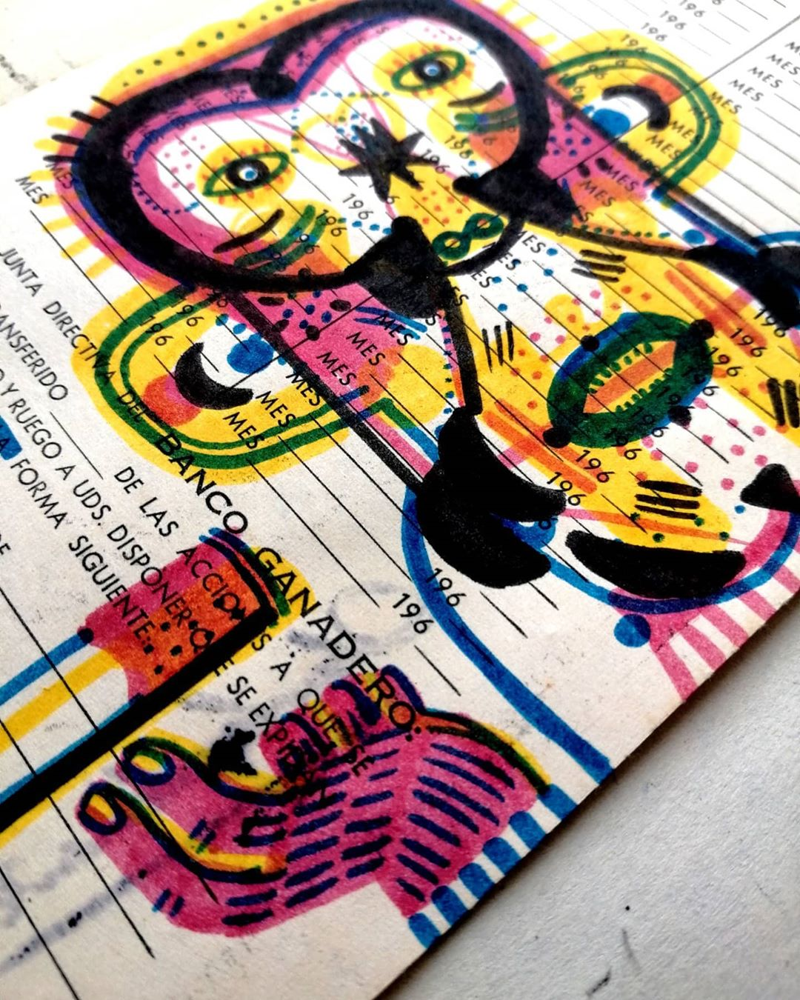
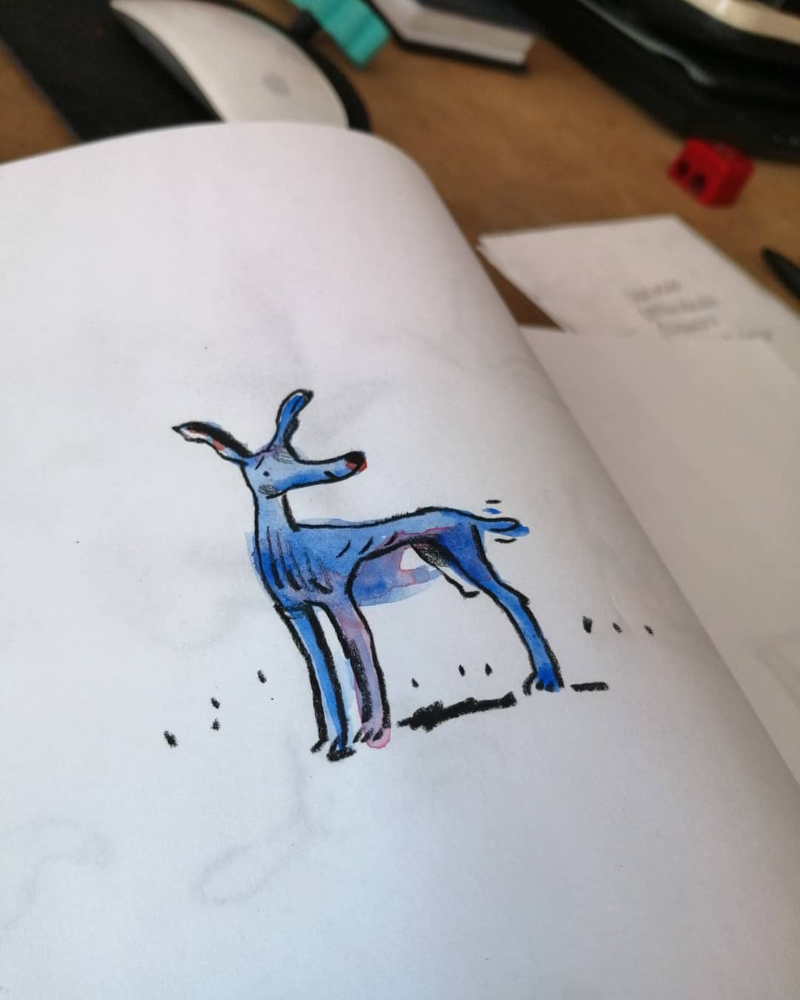

# 13/04/2020

**Contents**

*Tech*

- Revision2020 Notes
- Revision2020 Seminar: Implementing a Physically Based Shading without locking yourself in
- Revision2020 Seminar: Modern 64k intro compression (Ferris)
- Random Revision2020 notes
- C64 demos I liked
- Interesting person: Inigo Quilez
- Interesting person: Flopine

*Science*

- Discover the Fingerprint of Your Electrical Appliances 
- Jupyter Notebooks: simple graph of sin(x) / x
- Some useful resources for working with Jupyter notebooks and Python

*Art*

- Interesting Artists: Santiago Guevara
- Other interesting Domestika courses


## ◻ Revision2020 Notes

It's that time of the year again: **Revision 2020 party**. This weekend (Easter weekend) the Coronavirus has forced the demo party to be remote which means we get to experience it. In here I'll drop my notes and links to stuff I find interesting.

### 256b Dosbox demo

The first demo that caught my eyes is [this one](https://www.youtube.com/watch?v=Imquk_3oFf4). Its a 256 **byte** demo. I always find it amazing this can be done so I want to try to understand some of the trick used here. Fortunately this time the entry ([you can downoad it here](https://www.pouet.net/prod.php?which=85227)) comes with the source code! To run it (in Linux, of course) all you need is to install `dosbox` (and `nasm` if you want to compile the code) with:


 `$ sudo apt-get install dosbox nasm`

 unzip it in a directory and run it with:

 `dosbox -conf dosbox-0.74-3.conf memories.com`

to compile do:

  `nasm memories-dosbox.asm -fbin -o test.com`

This will work fine without audio (at least in my case there is no audio. I'll see how to set it up a bit later)

I'll write more notes here as I dive into the code. First some reminder of the registers in the 8086/80256 to understand a bit the listing:



**Notes**

- To look at the status of registers and debug the app you can run DEBUGX with Dosbox with:

  ```
  $ dosbox -conf dosbox-0.74-3.conf DEBUGX.COM
  ```


### Links 🔗

- [Memories 256b demo](https://www.pouet.net/prod.php?which=85227) - Entry in Pouet.
- [YouTube Video of demo running](https://www.youtube.com/watch?v=Imquk_3oFf4) - Video where can see the demo running
- [The list of all interrupts that are currently supported by the 8086 assembler emulator](http://www.ablmcc.edu.hk/~scy/CIT/8086_bios_and_dos_interrupts.htm)
- [Introduction to x86 Assembly Language](http://www.c-jump.com/CIS77/ASM/Assembly/lecture.html) - lecture notes from course [CIS-77 Introduction to Computer Systems](http://www.c-jump.com/CIS77/CIS77syllabus.htm)
- [Modes of Memory Addressing on x86](http://www.c-jump.com/CIS77/ASM/Memory/lecture.html) - lecture notes from same course as above
- [MS-DOS DEBUG Program](https://thestarman.pcministry.com/asm/debug/debug.htm)
- [MS-DOS Github repo with source code](https://github.com/microsoft/MS-DOS)
- [Graphics Programming Black Book by Michael Abrash](https://www.drdobbs.com/parallel/graphics-programming-black-book/184404919)

### Other cool 256b demos

- [256b - Enigma by Marquee Design](https://www.pouet.net/prod.php?which=85232)
- [Voladore](https://www.pouet.net/prod.php?which=85229) - [YouTube](https://www.pouet.net/prod.php?which=85229)
- [Apollo 21: No Signal](https://www.pouet.net/prod.php?which=85237) - [YouTube video](https://www.youtube.com/watch?v=XeN6jj4uI9A)


## ◻ Revision2020 Seminar: Implementing a Physically Based Shading without locking yourself in

This was an awesome presentation on the basic laws of physics involved in the propagation of light in different materials. The author (Zavie / Ctrl-Alt-Test) walks us through the different physical laws that related to how light bounces and travels through mediums. He also shows a Shadertoy demo which show how light interacts in a boundry between to mediums. The shader allows you to tweak a lot of parameters and you can see how interference between the sources at the interface give rise to the reflected and refracted wavefronts. Really neat!

### Links 🔗

- [Presentation](https://docs.google.com/presentation/d/1HAurGBpZ7OQPFc5IydRVUx3ZKfO8h7EIQp3At2vxM6Y/edit#slide=id.p)
- [Shadertoy with simulation of light hitting a boudry](thttps://www.shadertoy.com/view/tsfyRB)
- [Filament is a real-time physically-based renderer written in C++. It is mobile-first, but also multi-platform.](https://google.github.io/filament/)
- [Filament Github repo](https://github.com/google/filament)
- [Physically based shading references, at the end of 2019](http://lousodrome.net/blog/light/2020/01/04/physically-based-rendering-references-at-the-end-of-2019/)


## ◻ Revision2020 Seminar: Modern 64k intro compression (Ferris)

This is a seminar that talks about squishy which is an `.exe` -> `.exe` encoder. What this is is a program which takes as input an Windows executable and produces an *new* executable but with a much smaller size. The compressor is optimized for 64K demos. The talk is very good. Some takeaways and things he talks about:

- Discusses a strategy to lay down the Header, Code and Data sections of the EXE and create a new EXE which compresses the memory. The new EXE created has the uncompressor and the data needed to explode the info and recreate the original EXE.
- Also talks about techniques for re-linking the EXE to its DLLs without needing to maintain the original names
- It then goes to 'the meat' of the talk: discuss models for compressing strings of bits
- probabilities of `1` or `0` might depend on what happened in previously so probabilities are *not* independent on the order. It explores and talks about may different strategies to create predictors which will compress nicely depending on the type of correlations in the data.

### Ideas💡

- Investigate if ML techniques can be used to try to predict what bits are next

### Links 🔗

- [Slides](https://docs.google.com/presentation/d/1R5rUtGlJdMhkZoLYLzVKF4iV__APYYpxRoowaX8_anQ/edit#slide=id.p)


## ◻ Random Revision2020 notes

### Links 🔗

Some random links of interesting stuff I saw:

- [Teach Yourself Demoscene in 14 Days](https://github.com/psenough/teach_yourself_demoscene_in_14_days)
- [The book of shaders](https://thebookofshaders.com/)
- [tooll.io]](http://www.tooll.io/) - A free tool to create beautiful interactive realtime content
- [Tooll.io Github repo](https://github.com/framefield/tooll) - The repo of said tool.
- [Bonzomatic](https://github.com/Gargaj/Bonzomatic) - Tool used to do the shader showdowns


**Demos I liked**

These are some categories and demos I liked which belonged to that category.

**4K Intro**

- [4k Intro - stuck by jetlag](https://www.pouet.net/prod.php?which=85243) - [YouTube](https://www.youtube.com/watch?v=5k0OiT8X3z0)

**Amiga**

- Amiga demo - Netflex und Chill

**Oldskool**

- [Merkén - Gameboy demo](https://www.pouet.net/prod.php?which=85246)

**PC Demo**

- [Playlist in YouTube with all PC Demo entries](https://www.youtube.com/watch?v=TTurqolLDRM&list=PLr8dKmx4nsukXKnwwyunf8TES7bz-hej-&index=3&t=0s)
- Erpholia
- Parallel Multiverse Oldskool Java Demo [Source code]](https://github.com/Moon70/ParallelMultiverse)
- Second One - WebGL
- Eternal Forress
- Transmissitting Beyond
- Isolated, In Sunlight
- Dopaminecraft - Made with Notch
- Twisted
- VX2
- Cathodoluminescence
- Home - Tooll3


## ◻ C64 Demos I liked



Saw a [Twitch stream](https://www.twitch.tv/mibric64/) from mibric64 which basically plays C64 demos and intros. The following one I liked the esthetics:

- Pearls for Pigs - [YT](https://www.youtube.com/watch?v=xM8Zk1-z5m4)
- Monomania by Offence - [YT](https://www.youtube.com/watch?v=8Dz0PrbPbPY) [Pouet](https://www.pouet.net/prod.php?which=80430)
- My Life (2018) - LMan [CSDB](https://csdb.dk/release/?id=170977) - SID track


## ◻ Interesting person: Inigo Quilez

Spanish, Basque Country. A lot of resources on his site related to computer graphics, demoscene, shadertoy. Profiles on social media:

- [YouTube](https://www.youtube.com/user/mari1234mari)
- [Facebook](https://www.facebook.com/inigo.quilez.art/)
- [Twitter](https://twitter.com/iquilezles)
- [Shadertoy](https://www.shadertoy.com/user/iq)

## ◻ Interesting person: Flopine

She is a shader artist that won Revision2020 live coding competition.

- [twitch channel](https://www.twitch.tv/flopine)
- [Twitter](https://twitter.com/flopineyeah)
- [Shadertoy](https://www.shadertoy.com/user/Flopine)

- Look at 4k compo remina

You can see the video of the semi-finals of the shader compo [here](https://www.youtube.com/watch?v=xZ5lepZ3LcE). They use a live shader coding tool called [Bonzomatic](https://github.com/Gargaj/Bonzomatic).

## ◻  Discover the Fingerprint of Your Electrical Appliances 

For a potential work we are discussing with a client I learned about the concept of 'appliance fingerprint' where one can determine what appliances are connected to the electric network by monitoring the energy consumption as a function of time. Here are some references:

- "Towards Energy-Awareness Smart Building: Discover the Fingerprint of Your Electrical Appliances" - [IEEE Transactions on Industrial Informatics - reference](https://ieeexplore.ieee.org/document/8118142) [[PDF]](files/2020-04-13/Fingerprint-ma2017.pdf)
- [Smart meters to use algorithms to analyze electricity consumption](https://phys.org/news/2016-12-smart-meters-algorithms-electricity-consumption.html)
- [Electricity Fingerprint Analysis Technology for Monitoring Power Consumption and Usage Situations of Multiple Devices by Using One Sensor](https://www.nec.com/en/global/techrep/journal/g15/n02/pdf/150222.pdf?fromPDF_E6802)

Also during our meeting I learned about [Efergy](https://efergy.com/), a company which makes a device that you can connect to the live feed cable that comes into your house to monitor energy consumption as a function of time. This information is relayed to a hub which can then be collected on a server on the cloud to have a very clear view of your energy usage. With this information and the fingerprint you could potentially provide the user with ideas to reduce electrical usage. Another service is called **sense**: "Sense installs in your home’s electrical panel and provides insight into your energy use and home activity through our iOS, Android, and web apps.". [Web site](https://sense.com/)

### Ideas💡

- Build a proof of concept IoT device to with an ESP32 con measure current and push to the internet.
- Use the same method to measure very small currents on a cellphone battery to measure power consumption for the loading of a web-page. ♻

## ◻ Jupyter Notebooks: simple graph of sin(x) / x



To continue analyzing the 256 byte demo "memories" I needed to do some calculations and graph some functions. For this I used Jupyter which is really great. Since I hadn't used it much I needed to learn how to do a quick graphic. I found this video which was really helpful and has some great tips.

[YouTube Video - Learn Jupyter Notebooks (Pt. 1) Plotting](https://youtu.be/Hr4yh1_4GlQ)

For plotting he uses the "Matplotlib" Python library. You can see all the documentation [in this link](https://matplotlib.org/tutorials/).


## ◻  Some useful resources for working with Jupyter notebooks and Python

To work with Jupyter notebooks there are a couple of libraries that are 'essential'. Here are some useful links / resources


- This course on *"Introduction to Scientific and Mathematical Computing"* has a very nice sumary of basic things you need to do in Python: [Python Tool](http://www.math.buffalo.edu/~badzioch/MTH337/python_tools.html). The section on [Image processing](http://www.math.buffalo.edu/~badzioch/MTH337/PT/PT-image_processing/PT-image_processing.html) is particularly succint.
- For graphing data one recomended library is [matplotlib](https://matplotlib.org/)
- For managing arrays (vectors, matrices, etc) the standard is to use [NumPy](https://numpy.org/)
- [Scipy Lecture Notes](http://scipy-lectures.org/) - One document to learn numerics, science, and data with Python. Over 650 pages. - [[PDF ~ 20MB]](http://scipy-lectures.org/_downloads/ScipyLectures-simple.pdf). [Github repo with examples](https://github.com/scipy-lectures/scipy-lecture-notes)


## ◻  Interesting Artists: Santiago Guevara

I was looking at the art courses in domestika and came across one by Santiago Guevara. I liked his style so I added him to my Instagram. Here is some of his work and a link to the course in Domestika.








### Course on Domestika

Here's the link to his course (in Spanish): [Crea tu primer cuaderno de dibujo](https://www.domestika.org/es/courses/995-cuadernos-de-dibujo-encuentra-un-lenguaje-propio)

You can check his [Instagram account here](https://www.instagram.com/santiagoguevarag/)


## ◻  Other interesting Domestika courses

The Domestika platform has a lot of great crouses. Here are some that caugh my eye:

- [Fotografía profesional para Instagram](Fotografía profesional para Instagram)
