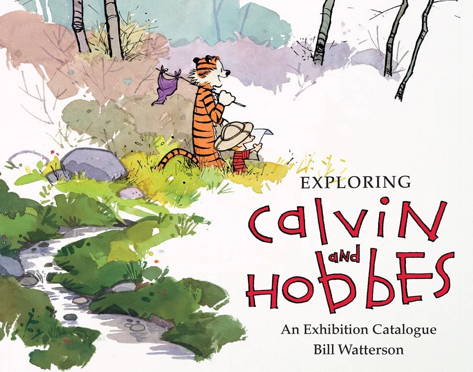
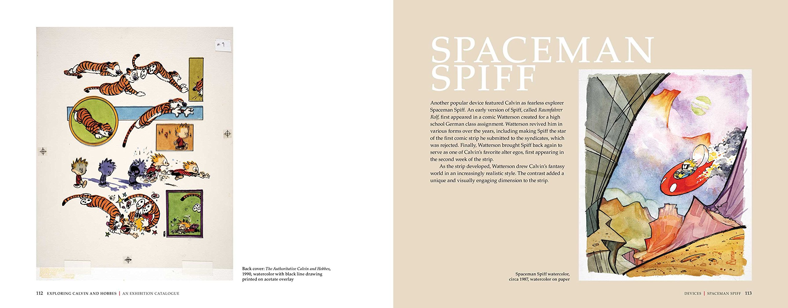

# 20/04/2020

**Contents**

*Tech*

- Sizecoding: incredible tiny demos and more
- Coding fonts

*Art*

- Exploring Calvin and Hobbes: An Exhibition Catalogue 

## ◻ Sizecoding: incredible tiny demos and more

This week HellMood released [a thorough explanation to his 256 byte intro](http://www.sizecoding.org/wiki/Memories). In his article he mentions a *lot* of tiny demos I hadn't head of. Some of them looked really cool. I also hadn't heard of the [sizecoding wiki](http://www.sizecoding.org/wiki/Main_Page) where you can find a lot of resources related to sizecoding. All of this triggered the idea of creating *another* Github repo with my favorite mini demos intros: [here it is](https://github.com/cesarmiquel/tiny-demos)

### Links 🔗

- [explanation to "memories" 256 byte intro](http://www.sizecoding.org/wiki/Memories)
- [sizecoding wiki](http://www.sizecoding.org/wiki/Main_Page)
- [tinycode reddit channel](https://www.reddit.com/r/tinycode/)
- [MAGFest 2020: Tiny Coding: Making Big Games with Little Code - YouTube](https://www.youtube.com/watch?v=8ogKnN3t7Nw) - Tinycode talk given by Frank Force
- [Frank Force Github account](https://github.com/KilledByAPixel) - A coder of JS tinycode coder. Livelong game developer, designer, coder, artist, musician, Buddhist, and friend to cats. [His website](https://frankforce.com/). [His DWitter user](https://www.dwitter.net/u/KilledByAPixel)
- [Dwitter.net - 140 char JavaScript code](https://www.dwitter.net/) - Place where you can upload 140 Chars of JS. Awesome.
- [JS13KGames](https://js13kgames.com/) - JavaScript games which are at most 13k
- Pico 8 - Tweetjam: you can write minimal Pico 8 code which you can Tweet. You can search #Tweetjam

### Ideas💡

- Create a Git repo with a list of my all time favorite tiny demos / intros.

## ◻ Coding fonts

Last week I updated my Ubuntu to **19.10** and in the process seem to have lost the coding font I was using. I searched for whats new in 2020 and after a couple of different tests I settled on two fonts:

### Monoid

[Monoid](https://larsenwork.com/monoid/) - This is a little more condensed so it is a little more crowded. I get good/readable results with 9 or 10.

### Hack

[Hack](https://sourcefoundry.org/hack/) - I'm currently using Hack Regular 10

I honestly love ❤️  both fonts so I'm kind of constantly switching between them :-).

## ◻ Some artists I would like to explore

While taking a course in Domestika the instructor mentioned a couple of artists I would like to explore.

- Power Paola: Colombian comic book artist. [[Blogpost link]](http://powerpaola.blogspot.com/) [[Instagram]](https://www.instagram.com/powerpaola)
- Jean-Michel Basquiat - was an American artist of Haitian and Puerto Rican descent. Basquiat first achieved fame as part of SAMO, an informal graffiti duo who wrote enigmatic epigrams in the cultural hotbed of the Lower East Side of Manhattan during the late 1970s, where rap, punk, and street art coalesced into early hip-hop music culture. By the 1980s, his neo-expressionist paintings were being exhibited in galleries and museums internationally. The Whitney Museum of American Art held a retrospective of his art in 1992. [[Wikipedia article]](https://en.wikipedia.org/wiki/Jean-Michel_Basquiat)

## ◻ Exploring Calvin and Hobbes: An Exhibition Catalogue

Calvin and Hobbes is unquestionably one of the most popular comic strips of all time. The imaginative world of a boy and his real-only-to-him tiger was first syndicated in 1985 and appeared in more than 2,400 newspapers when Bill Watterson retired on December 31, 1995. Exploring Calvin and Hobbes contains never-before-seen early versions of the character and a new in-depth interview with Bill Watterson. [[Book in Amazon]](https://www.amazon.com/-/es/Bill-Watterson/dp/1449460364)

