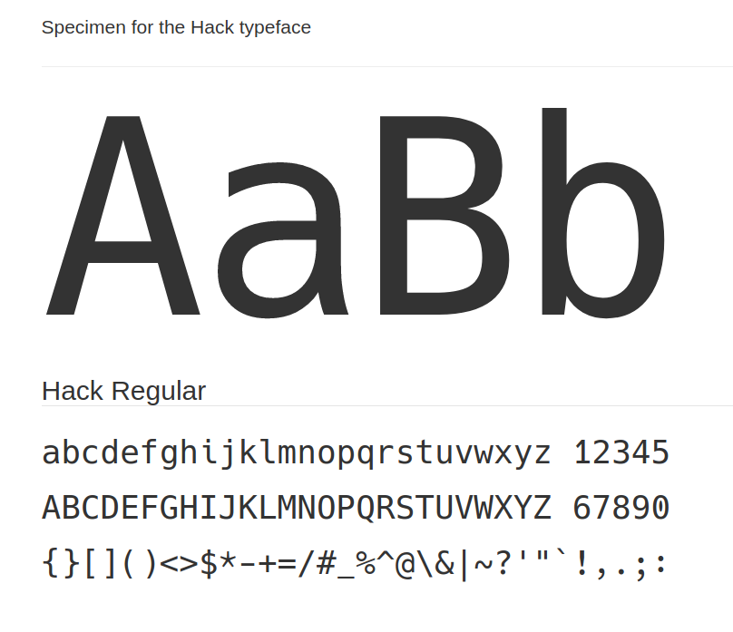

# 20/04/2020

**Contents**

*Tech*

- Sizecoding: incredible tiny demos and more
- Coding fonts

## ◻ Sizecoding: incredible tiny demos and more

This week HellMood released [a thorough explanation to his 256 byte intro](http://www.sizecoding.org/wiki/Memories). In his article he mentions a *lot* of tiny demos I hadn't head of. Some of them looked really cool. I also hadn't heard of the [sizecoding wiki](http://www.sizecoding.org/wiki/Main_Page) where you can find a lot of resources related to sizecoding. All of this triggered the idea of creating *another* Github repo with my favorite mini demos intros: [here it is](https://github.com/cesarmiquel/tiny-demos)

### Links 🔗

- [explanation to "memories" 256 byte intro](http://www.sizecoding.org/wiki/Memories)
- [sizecoding wiki](http://www.sizecoding.org/wiki/Main_Page)
- [tinycode reddit channel](https://www.reddit.com/r/tinycode/)
- [MAGFest 2020: Tiny Coding: Making Big Games with Little Code - YouTube](https://www.youtube.com/watch?v=8ogKnN3t7Nw) - Tinycode talk given by Frank Force
- [Frank Force Github account](https://github.com/KilledByAPixel) - A coder of JS tinycode coder. Livelong game developer, designer, coder, artist, musician, Buddhist, and friend to cats. [His website](https://frankforce.com/). [His DWitter user](https://www.dwitter.net/u/KilledByAPixel)
- [Dwitter.net - 140 char JavaScript code](https://www.dwitter.net/) - Place where you can upload 140 Chars of JS. Awesome.
- [JS13KGames](https://js13kgames.com/) - JavaScript games which are at most 13k
- Pico 8 - Tweetjam: you can write minimal Pico 8 code which you can Tweet. You can search #Tweetjam

### Ideas💡

- Create a Git repo with a list of my all time favorite tiny demos / intros.

## ◻ Coding fonts

Last week I updated my Ubuntu to **19.10** and in the process seem to have lost the coding font I was using. I searched for whats new in 2020 and after a couple of different tests I settled on two fonts:

### Monoid

[Monoid](https://larsenwork.com/monoid/) - This is a little more condensed so it is a little more crowded. I get good/readable results with 9 or 10.

### Hack

[Hack](https://sourcefoundry.org/hack/) - I'm currently using Hack Regular 10

I honestly love ❤️  both fonts so I'm kind of constantly switching between them :-).
